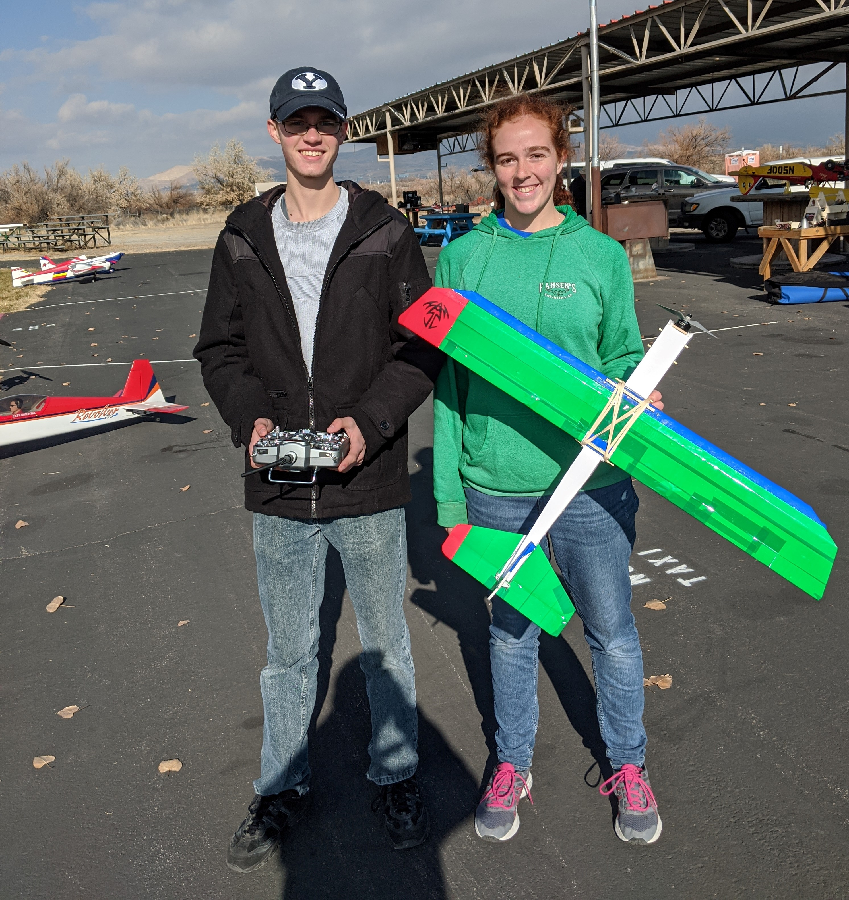

The BYU Aeronautics Club is the only club on campus dedicated to the design, construction, and flight of fixed-wing UAV's. We started in 2018 as a small shoot-off from the local BYU branch of AIAA (American Institute of Aeronautics and Astronautics). Dedicated leadership and club members helped to build this club into a community of students commited to engineering excellence. We take students from any major or background, teaching you importanct concepts to be successful and enjoy the entire process. 

As you continue to grow through your experiences in the club, you will see large payoffs as part of the team-based exerience. You will learn to apply principles of design, leadership, teamwork, manufacturing, mission development, performance measurement, and much more. Members of this club have gone on to pursue graduate degrees at high-ranking universities, fill competitive positions in industry, and overall become influential leaders in the field of aerospace. Join us and be part of this unique opportunity to become more than you could on your own.

### Weekly Zoom Meetings: 
5pm on Thursdays

[Zoom Link](<https://byu.zoom.us/my/>){: .btn .btn--info}

### Contact Us:
Email: byuaeronautics@gmail.com

[Facebook Message](<http://facebook.com/BYUAeronautics>){: .btn .btn--info}

### Sign Up for Weekly Emails:
[Sign Up](<http://eepurl.com/do8S9T>){: .btn .btn--info}

### Club Payments Page:
[Make Payment](<https://commerce.cashnet.com/webcaroc>){: .btn .btn--info}
