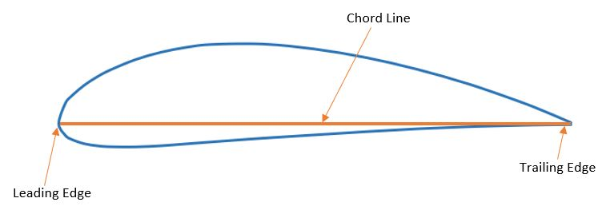
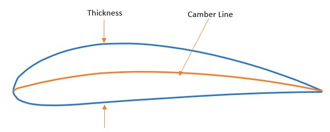

Airfoil selection is one of the earliest and most important decisions made when desiging your UAV. The airfoil will play a large role in determining its aerodynamic performance characteristics and capabilities. As such, care should be taken to choose an airfoil that properly meets the performance requirements for your mission. Relevant requirements may relate to stability, lift and drag characteristics, and manufacturability. These and other important concepts will be discussed.

## Airfoil Geometry
To start, let's discuss the different parts of an airfoil. As you can see below, an airfoil typically has a thin, long profile. This provides large amounts of lift with minimal drag. The front (or forward most part) is called the leading edge, while the back (or aft most part) is called the trailing edge. If you were to draw a straight line from edge to edge, this would be called the chord line and its length is the chord length (or just "chord").

 

### NACA Airfoils
The NACA four-digit series provides a convenient way to demonstrate some additional airfoil parameters. Each digit describes a different parameter of the airfoil. Let's use the NACA 4412 airfoil as an example. The first two digits describe the magnitude and placement of the camber, respectively. In this case, there is a 4% maximum camber at 40% of the chord length from the leading edge. The last two digits give the maximum thickness, which is 12% of the chord length here.

To explain camber, we refer to the diagram above. The camber line lies exactly (vertically) between the upper and lower surfaces of the airfoil at any point. Camber is the relative distance between the chord line and camber line, measured in chords.

## Lift and Drag Performance

## Other Considerations
Like most design decisions for a UAV, there are tradeoffs in selecting an airfoil.

## The UIUC Airfoil Database

## Formatting Airfoils for XLFR5

