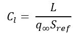
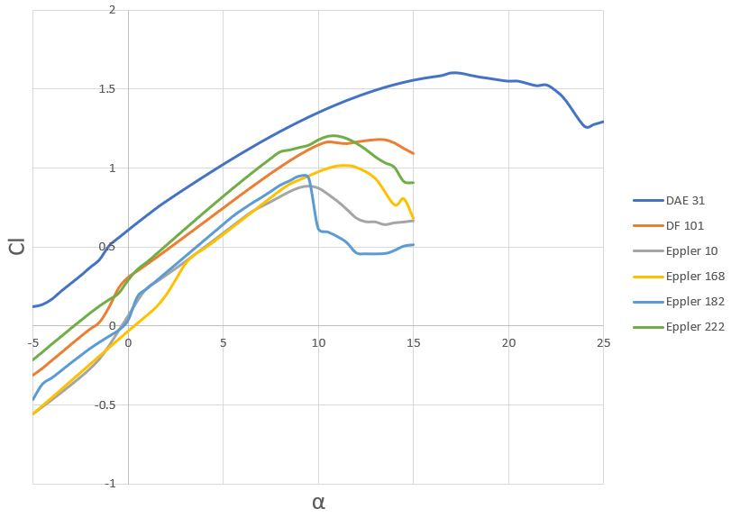
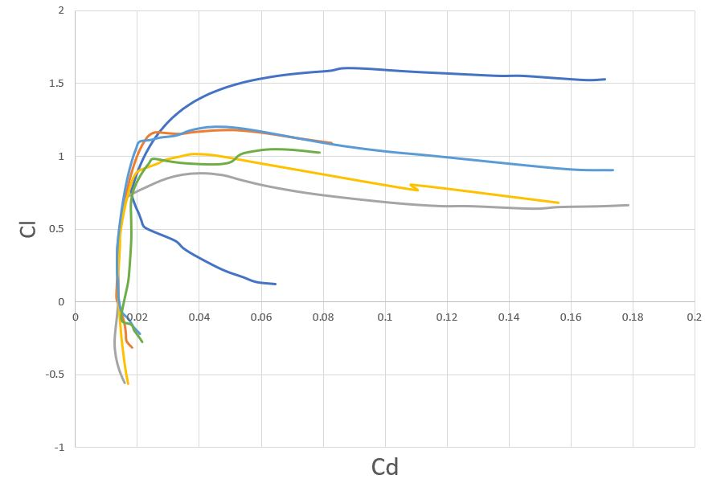
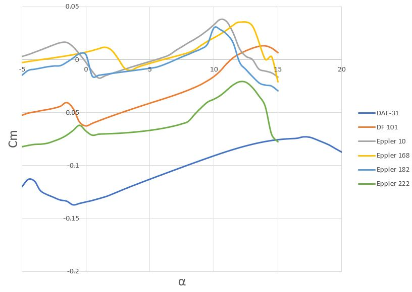
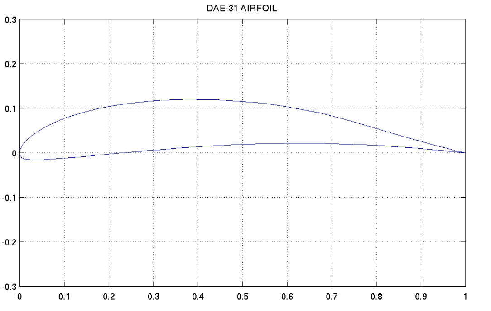
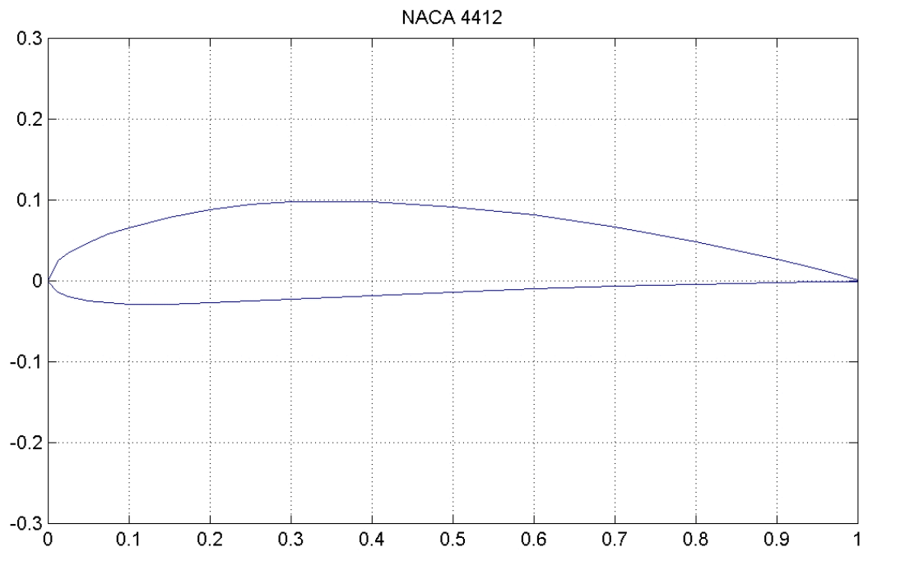

Airfoil selection is one of the earliest and most important decisions made when desiging your UAV. The airfoil will play a large role in determining its aerodynamic performance characteristics and capabilities. As such, care should be taken to choose an airfoil that properly meets the performance requirements for your mission. Relevant requirements may relate to stability, lift and drag characteristics, and manufacturability. These and other important concepts will be discussed.

## Airfoil Geometry
To start, let's discuss the different parts of an airfoil. As you can see below, an airfoil typically has a thin, long profile. This provides large amounts of lift with minimal drag. The front (or forward most part) is called the leading edge, while the back (or aft most part) is called the trailing edge. If you were to draw a straight line from edge to edge, this would be called the chord line and its length is the chord length (or just "chord").

 

### NACA Airfoils
The NACA four-digit series provides a convenient way to demonstrate some additional airfoil parameters. Each digit describes a different parameter of the airfoil. Let's use the NACA 4412 airfoil as an example. The first two digits describe the magnitude and placement of the camber, respectively. In this case, there is a 4% maximum camber at 40% of the chord length from the leading edge. The last two digits give the maximum thickness, which is 12% of the chord length here. Most small UAV's have a thickness-to-chord ratio of about 8-14%.

To explain camber, we refer to the diagram above. The camber line lies exactly (vertically) between the upper and lower surfaces of the airfoil at any point. Camber is the relative distance between the chord line and camber line, measured in chords. Generally, a more cambered airfoil will provide more lift with decreased aerodynamic stability.

## Lift and Drag Performance
One of the most important considerations when selecting an airfoil is the lift and drag characteristics. These and a few other metrics will indicate the airfoil's performance. We will focus first on lift. Keep in mind that with airfoils we are calculating a theoretical coefficient of lift (Cl). The coefficient of lift is a nondimensional parameter that helps us to understand the general lifting capabilities of an airfoil (see equation below). This is different than lift itself, which is simply the force acting on an aircraft perpendicular to the free stream. This is explained in further detail in the section on aerodynamic performance.

{: .align-center}

There are a few key characteristics you are looking for that will be shown on your lift and drag polars. Let's look at the polar that plots the coefficient of lift as a function of angle of attack (α) for various airfoils. The first thing you should notice is the general shape of the polar. There is at first a linear relationship between the Cl and angle of attack. As you increase the angle of the airfoil relative to free flow, the coefficient of lift will increase with a slope of about 2π (Cl/α in radians). At around 10-12 degrees, the airfoil begins to stall, meaning that large amounts of drag are beginning to occur and lift is being lost. This is represented on the polar by a peak and eventual downward curve. 

Some airfoils have a higher peak than others, signifying a higher maximum Cl. This is advantageous because it allows the UAV to take off with smaller lifting surfaces and increases overall aerodynamic efficiency. Here, the airfoil represented by the pink line obviously has the highest Cl max (about 1.6). Another interesting feature is the shape of the peak. A gentler downward curve represents an airfoil with a more forgiving stall development. For example, lift will be lost more gradually on the airfoil represented by the golden line than the red line, which drops sharply and will lose lift very quickly after beginning to stall at Cl max.

Let's take a look at another polar. This one shows the coefficient of lift (Cl) as a function of the coefficient of drag (Cd). This is useful mostly in helping us to determine the maximum lift over drag ratio, or L/D. If you draw a straight line from the origin upward, then pivot it until it touches the polar, the slope is the airfoil's theoretical maximum L/D. The lift over drag ratio is a common way to determine the optimum flight scenario for your UAV because it provides the highest efficiency in terms of lift and drag. Other performance concepts will be discussed elsewhere.

This last polar is more concerned with the general stability of the airfoil. Here, we plot the coefficient of the pitching moment (Cm) as a function of the angle of attack. Notice that all of the lines are generally flat, but have varying magnitudes. This magnitude has to do with the general lateral stability of the airfoil. A higher magnitude will result in a less stable airfoil, but is usually accompanied by better lifting capabilities. In any case, this data should be used as more of a tie-breaker when selecting an airfoil rather than a key requirement.

## Comparing Airfoils
When selecting an airfoil, it is useful to compare at least 10-15 different airfoils to have sufficient numbers for a good selection. This can be done using XFLR5's airfoil direct analysis feature or another program. It is good practice to create plots with an angle of attack ranging from -4 to 16. Some airfoils may require a larger range to see the full curve before the stall point is reached. 

One additional consideration that should be made is the general shape and curvature of the airfoil. If lift and drag characteristics alone are considered, you may be stuck with an airfoil that is thin, curvy, and difficult to manufacture. A thin airfoil will often be difficult to create with the foam cutter, and will experience frequent breakage. As an example, let us consider the two airfoils below. In this case, the DAE-31 airfoil has a higher Cl max and better stall and drag characteristics. The NACA 4412 airfoil has somewhat comparable characteristics, but is significantly thicker and easier to manufacture. This makes it the preferred selection in most cases for small UAVs.

 

## The UIUC Airfoil Database
When it comes to getting data for UAV airfoils, the [UIUC database](https://m-selig.ae.illinois.edu/ads/coord_database.html) is likely the best public resource available. It boasts a collection of over 1,500 different airfoils with various characteristics and applications. You can view plots of the different airfoil shapes as well as download a text file containing the data itself (typically 50-100 points). Many of the airfoils appropriate for small UAVs are labeled "low Reynolds number airfoil". This essentially means that they are designed for aircraft that fly at relatively low speeds. A couple of good series to begin looking at are the Eppler and Selig series. 

## Formatting Airfoil files for XLFR5
In order to be able upload airfoil data files to XFLR5 for analysis, there is a specific format that the data points need to be in. 
