One of the primary concerns when designing any aircraft is to minimize the amount of drag it experiences. All of the drag forces we will discuss here can be directly attributed to either pressure or shear. A summary of these forces and how they produce lift and drag can be found in the section on [fluid mechanics](https://aeronautics.byu.edu/fundamentals/aerodynamics/fluids/). Here, we will focus more on calculating the magnitude of the drag forces so you can understand what parameters contribute to them and the characteristics of your UAV.

## Parasitic Drag
There are essentially three different types of drag that we are dealing with. Two of these (skin friction and pressure) can be summed up to become parasitic drag. Skin friction drag is caused by shear stress while pressure drag is caused by normal stress from pressure. Both of these will be factored into a single equation that can be used to calculate the total parasitic drag.

For skin friction, we want to calculate the *skin friction coefficient*, which is given the symbol Cf. To calculate this completely accurately, it would be necessary to perform an integral of the shear stress across across the entire surface. Doing so is quite difficult, so we will use a simpler solution that is the analytical solution for a flat plate in laminar with no pressure gradient. This is called the Blasius solution and is summarized in the equation below.

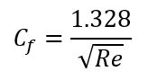{: .align-center}

Since laminar flow only includes flow up to a Reynold's number up to 500,000, we can use the equation below for turbulent flow. 

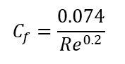{: .align-center}

To factor in pressure drag, we will calculate a *form factor*, which is represented by a lowercase k. This accounts for the thickness of the surfaces that are producing lift. Since a typical small UAV travels at low speeds relative to the speed of sound, we can neglect compressibility factors and use the equation below where &#x03B3; is the [sweep](https://aeronautics.byu.edu/fundamentals/aerodynamics/configurations/#basic-geometry) angle of the surface and t/c is the [thickness-to-chord ratio](https://aeronautics.byu.edu/fundamentals/aerodynamics/airfoils/#naca-airfoils) of the airfoil.

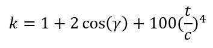{: .align-center}

For a body of revolution (such as a fuselage), we use a different formula based on on the *fineness ratio* (fr) which is defined as the length over the maximum diameter (l/d). For fineness ratios between 5 and 15, we can use the formula below to calculate the form factor. For fineness ratios over 15, the form factor will be assumed to be 1. 

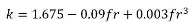{: .align-center}

Next we want to calculate the total area of the UAV that is exposed to air. This is typically referred to as the *wetted area*, or Swet. For a lifting surface, it can be approximated using the equation below. The reference area (Sref) is simply the planform, or projected, area of the component. For a body of revolution, simply find the outer surface area of the shape using known formulas.

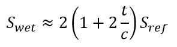{: .align-center}

Putting this all together, we can calculate the parasitic drag for each component of an airplane using the formula below. To get the total drag, you will have add up the parasitic drag for each component individually since they have different form factors and wetted areas. 

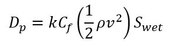{: .align-center}

To nondimensionalize this into a coefficient, we can use the definition of the drag coefficient and apply it to parasitic drag, as in the equation below. For this equation, Sref is simply the planform area of the component. It is good practice to add about 10% to your final values to account for any additional sources of drag that are not covered here.

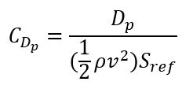{: .align-center}

## Induced Drag
The third type of drag we are dealing with, *induced drag*, is closely related to the lift produced by the aircraft. In fact, induced drag is the component of the induced lift vector that is parallel to the free stream. The other component of this vector is the actual lift benefitting the UAV. In any case, we need to know a few things about the lift characteristics of a UAV before calculating induced drag.

The first thing we want to find is the *inviscid span efficiency*. This is a measure of how elliptic the lift distribution is across the wing. A perfect distribution would have an efficiency of 1.0 to minimize induced drag, but most aircraft are closer to 0.98. To estimate this, we use the following equation where df is the fuselage diameter and b is the span of the wing. 

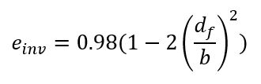{: .align-center}

We also will need to know the coefficient of lift, which is defined below. For this formula, we will assume steady, level flight so that the lifting force is equal to the UAV's weight. 

{: .align-center}

Next will introduce another term called the *Oswald efficiency factor*. This is basically just a grouping of terms used to simplify the overall equation for the induced drag coefficient. Notice that the parasitic drag coefficient is included. This is because the viscous portion of induced drag is proportional to the parasitic drag according to empirical data. 

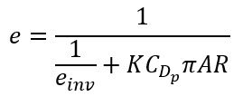{: .align-center}

We can now calculate the coefficient of induced drag using the formula below. This can be added to the coefficient of parasitic drag to produce the total drag coefficient for a UAV. 

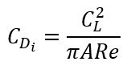{: .align-center}

If you would like to then calculate the actual drag force, you can combine everything up to this point to produce the equation below.

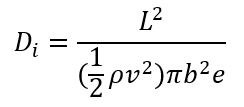{: .align-center}
