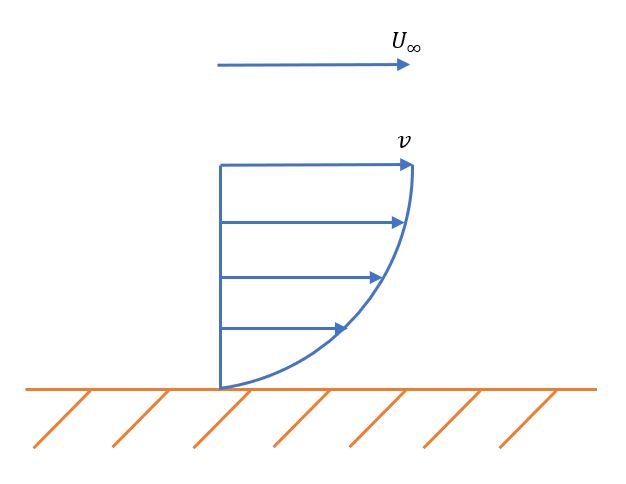

In order to begin to understand the complexities of designing a small UAV, it is important to first have some grasp of the fundamentals of the fluid (air) within which they operate. This page is a short guide to the most relevant principles, and is not meant to be a reference or comprehensive source for understanding fluid mechanics. It can, however, be a great starting point for understanding important concepts. These concepts will help you to have a basic idea of what is really going on in flight and to develop your own intuition for making design decisions throughout your project.

## Fluid Characteristics
By definition, a fluid includes both gases and liquids. These are classified together since priniples of fluid of mechanics apply to both accurately. Both gases and liquids have weaker molecular forces than solids, creating an indefinite shape and volume. It is typically taught that liquids have a definite shape, but this is incorrect since they can be compressed if enough pressure is applied. As a reference, air is about 22,000 times more compressible than water. The weaker molecular forces in all fluids allow them to move and create a flow through or around a volume (such as an airplane).

When a fluid flows, a no-slip condition is assumed wherever it contacts a solid. This means that the flow velocity of the fluid at any point it contacts a solid is zero. The velocity increases outward from the surface until it gets to the free stream velocity (U∞). This occurs in a quadratic fashion, as shown below. The portion of the flow that has a changin velocity profile is of particular interest to us because this is where the aircraft is dealing with a variety of aerodynamic forces. It is referred to as the boundary layer.

### The Boundary Layer

### Laminar and Turbulent Flow

### The Bernoulli Equation

## Airfoils in Fluids

### Lift and Drag
