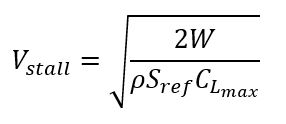
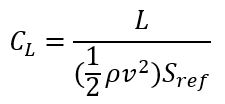

The way you design your UAV will be largely driven by the mission and design requirements you defined at the outset of your project. Depending on the mission, there are a large variety of aircraft that could be designed to fulfill your mission. However, there are some universal principles of flight that will be essential in determining the feasibility of your UAV. As you refine your design using these principles, your UAV will improve in its ability to perform as an aircraft and fulfill its mission.

## Static Stability
As you begin refining your UAV design, one of your first concerns should be stability. Static stability is a principle from dynamic systems that involves a system's tendency to return to a steady condition. To demonstrate this, imagine a block on a horizontal spring, as in Figure 1. In this case, the steady condition is when the block is at rest. If the system were at least statically stable, the block would oscillate around the stead position (even if it never stopped there). It is important to note that this occurs because of the physcial parameters of the system and not due to any sort of outside force. If the system were not statically stable for whatever reason, the block would continue to move in the direction of the force vector without having any sort of tendency to return to the steady position.



For a UAV, static stability stability must be present for all three axes of rotation: pitch, yaw, and roll. Stability in pitch is most difficult to achieve and is categorized alone under longitudinal stability. Yaw and roll are grouped together under lateral stability. We will discuss each.

### Longitudinal
For a UAV, longitudinal static stability is related to the relative placement of its *aerodynamic center* and its *center of gravity* (CG). As a rule of thumb, the aerodynamic center is located at about 25-33% of the chord length back from the leading edge of the main wing. It is defined as the point where the pitching moment does not vary with angle of attack. It is also at this location that all of the aerodynamic forces and moments can be summed up, while gravity acts through the CG (see Figure 2). The exact position of the aerodynamic center can be done using programs such as [XFLR5](https://aeronautics.byu.edu/fundamentals/aerodynamics/xflr5/) or [AVL](http://web.mit.edu/drela/Public/web/avl/).



In order for a UAV to be statically stable, the aerodynamic center must be aft of the CG. This is what creates the tendency of the aircraft to return to a steady flight position. The distance between these two points is defined by a value known as the *static margin* (see Figure 3). It is defined as the distance between the aerodynamic center and CG divided by the mean aerodynamic chord (x/c). The result is a decimal that is represented as a percent. A typical small UAV will have a static margin of 12-15%. This value is most effected by the relative positioning and size of the main wing and horizontal stabilizer. 



### Lateral
Creating static stability for the yaw and roll axes is generally a bit simpler to do. For roll, the main consideration is how much *dihedral* you put into your wing. Dihedral is a measure of the angle between the main wing and the horizontal, represented by the symbol φ. It is typical for most small UAVs to have a dihedral of about 5-10° (for each wing individually). If additional roll stability is desired, especially for novice flyers, a polyhedral wing can be used. A polyhedral wing has a bending point on each wing, instead of just in the center. This is typically done with a smaller angle on the inner portion of the wing and a larger angle on the outer portion. Be aware, however, that too much dihedral can dampen the wing's ability to produce lift by putting a large angle on the lift vector.



To produce yaw stability, you only need sufficient horizontal stabilizer area. Doing so will prevent what is termed as *sideslip*, which is a yaw angle created by a disturbance of some kind. In most cases, the vertical tail size is determined by the amount of rudder control you need rather than a stability parameter. 

You can measure the lateral stability of your UAV using *stability derivatives*. These can be calculated using a program such as XFLR5. For yaw, you want the derivative Cn,&#x03B2; to least be greater than 0, but around 0.06-0.15 is a good range to be in. For roll, you actually want a negative value of the derivate Croll,&#x03B2; usually in the range -0.1-0. 

## Dynamic Stability
Recall that static stability was *any* tendency of a system to return to a steady condition. Dynamic stability is more a measure of how effectively that system returns to the stead condition. We will again use the block on the horizontal spring as an example. Imagine that a force-impulse is applied to the block. If the system is dynamically stable, the block will be sufficiently damped that the amplitude will decrease until the system is again at rest (see Figure 1a). If this were not the case, the block would continue to oscillate with increasing amplitude (see Figure 1b). 



For UAVs, we are concerned with how effectively they can return to a stead flight condition. This is done by measuring several dynamic stability modes. Something about real and imaginary //FIXME.

### Stability Modes

## Measures of Aerodynamic Performance
### Lifting Capability
The most basic way to determine if your UAV is airworthy is to determine if it can produce sufficient lift to overcome gravity. You may have noticed there isn't really a section anywhere on lift on this site. This is because compared to drag, lift is incredibly simple. Here, we simply need to look at the *stall speed* of your aircraft. The stall speed is defined as the minimum speed required to maintain altitude at maximum lift. It is related to the [Cl max](https://aeronautics.byu.edu/fundamentals/aerodynamics/airfoils/#lift-and-drag-performance) of the airfoil, as in the formula below (taken from the definition of coefficient of lift).

{: .align-center}

Notice the effect that span also has on the stall speed. A stall speed of about 10-12 m/s is typical for a small UAV, but minimizing this will allow you to lower your power requirements, which in turn saves weight (and money). If you get much higher than about 15 m/s you will want to seriously consider redesigning some aspects of your UAV or you may not be able to achieve flight. 

You can also calculate the coefficient of lift that you will need at your anticipated cruise altitude by simply using the definition of coefficient of lift. Here, you will just replace the lifting force with the UAV's weight.

{: .align-center}

### Lift over Drag Ratio

